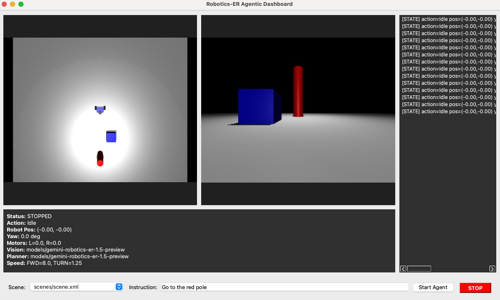

# Robotics-ER Dashboard

Gemini Robotics-ER を使った自律ロボット制御デモ。トップレベルの実行スクリプトは `er_dashboard.py`（Qt UI）です。それ以外のドキュメントやモジュールはサブフォルダに整理しています。

## 構成
- `er_dashboard.py` / `ai_robot_er.py`: 実行スクリプト
- `src/`: 共有モジュール（`tool_defs.py`, `geom_utils.py` など）
- `docs/`: 仕様・サマリ・状態遷移図など（`specifications.md`, `robotics_er.txt`, `state_machine.md` ほか）
- `tests/`: 単体テスト
- `logs/`: 実行ログ（`run_*.log`）
- シーンXML: `scenes/scene*.xml`



## 利用手順
1. リポジトリ取得  
   `git clone https://github.com/saotomryo/gemini-er-agentic-dashboard-test.git`
2. 依存インストール（例: Python venv を利用）  
   ```
   python -m venv .venv
   source .venv/bin/activate   # Windowsは .venv\Scripts\activate
   pip install -r requirements.txt
   ```
3. APIキーを設定  
   - `.env` に `GEMINI_API_KEY=<Your API Key>` を記載（または環境変数に設定）。
4. 起動方法  
   - Qt ダッシュボード: `python er_dashboard.py`  
   - デバッグログを出したい場合: `ER_DEBUG=1 python er_dashboard.py`
5. 画面上の手順  
   - Scene: ドロップダウンでシーンXMLを選択（初期は `scenes/scene.xml` など）。  
   - Instruction: 例) `Go to the red pole`（英語または日本語でも可）。  
   - Start Agent を押すと、プランニング→実行→ビジョン更新→ログ更新のループが始まります。  
   - STOP で即停止。
6. ログ確認  
   - `logs/run_*.log` に状態/プラン/ビジョン/マップなどが出力されます。  
   - `ER_DEBUG=1` の場合は詳細な `[DBG]` や `[TUNE][approach]` が含まれます。

## 使い方（概要）
- 依存をインストール後、`python er_dashboard.py` でQt版ダッシュボードを起動。
- OpenCV版デモは `python sim_dashboard.py` 。
- ログは `logs/run_*.log` に保存されます。デバッグは `ER_DEBUG=1` を環境変数で指定。

詳しくは `docs/` の各ドキュメントを参照してください。 README は随時更新します。  
