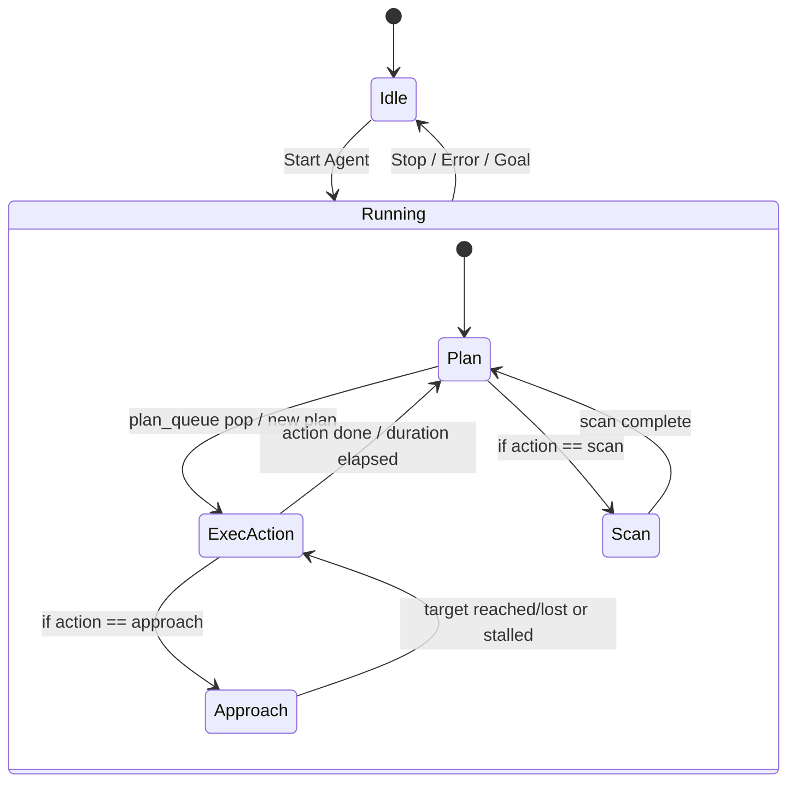

# Robotics-ER Dashboard 状態遷移と役割まとめ

本ドキュメントは、現在のダッシュボードにおける主要コンポーネントの役割と、実行中の状態遷移を示します。実装は `er_dashboard.py` をベースにしています。

## 主要コンポーネントと役割
- **Planner (Flash)**: 通常の単ステッププラン（`decide_next_step`）を生成。
- **ER Fallback Planner**: Flashで決定できない/`plan_queue` が空のとき、ツールコール型のマルチステップ `plan` を返す。
- **Executor**: `plan_queue` からアクションを取り出し、制御コマンドを実行。`approach` 時はビジョンに合わせてモーター更新。
- **Vision System**: BBox検出（未検出は`[]`）、誤検出フィルタ（端寄り大BBoxを破棄）、プロンプト/レスポンスをログ。
- **Progress Monitor (ER)**: `status/progress/comment` を推定し、`STALLED` なら停止→スキャンへ遷移。
- **Mapper (ER)**: プランニング時のみ呼び出し、簡易マップ/ターゲット位置を推定してログへ記録。
- **Motion Stall Detector**: 位置/ヨー変化が閾値未満なら停止→スキャンに遷移。
- **Logging**: 画面＋`logs/run_*.log` に `[STATE]`（シーン・plan_count含む）、`[PLAN]`、`[MAP]`、`[PROMPT]/[RESPONSE]`、`[DBG]` を記録。

## 状態遷移の概要

## タイミングと呼び出し

- **レンダリングループ** (`_on_tick`):
  - 物理ステップ → 画像取得。
  - `current_action` の時間経過確認、終われば停止→Planへ。
  - `plan_queue` が空 & 非thinkingなら Planner/Fallback を呼び、必要に応じて Mapper を一回呼ぶ（`map_interval`経過時）。
  - `approach` 中はビジョンポーリング（1.5s間隔）でモーター更新。
  - スキャン時は4方向撮影・旋回を順次実行。
  - Progress Monitor（6s間隔）で `STALLED` なら停止→スキャン。
  - Motion Stall Detector（3s間隔、ビジョン処理中はスキップ）で移動がなければ停止→スキャン。

- **Planner/Fallback**:
  - Planner: 単ステップ `{"action":...}`。
  - ER Fallback: `{"plan":[...],"step_count":optional}`。`plan_queue` に詰め、先頭を実行。

- **アクション実行**:
  - `turn_*` / `move_forward*`: 制御器から速度・時間を取得しセット。`duration_arg`/`angle_deg` があれば上書き。
  - `approach`: Vision結果でモーターを0.25s前後の短ステップ更新。端寄り大BBoxは破棄。
  - `scan`: 90度右回りを3回で4ビュー撮影。

## ログに含まれる情報
- `[PLAN] queued N steps (ER), intended=...` : ERから受けたプランのキュー長と意図ステップ数。
- `[STATE] ... plan_queue=... intended=...` : 現在の状態、位置/ヨー/モーター/BBox/シーンとプラン情報。
- `[PROMPT]/[RESPONSE]` : Vision/ER系のプロンプトと応答（未検出・失敗時を含む）。
- `[MAP] updated ...` : マッパーによる推定ターゲット/マップ。
- `[DBG] action=...` : 実行中のモーター指令とBBox。
- `[TUNE][approach]` : BBox中心/高さ/誤差とモーター値（チューニング用）。
- `[VISION] Found/Not found` : Vision検出結果（ファイルログにも記録）。

## 今後の観点（ER優先）
- ERに連続フレーム・行動履歴を渡し、距離/方向推定やマップ更新をより積極的に行う。
- プラン生成で「遠距離は長ステップ、近距離/障害物近は短ステップ」を明示する。
- ジャイロ/オドメトリがあればER入力に含め、推定精度を上げる。
